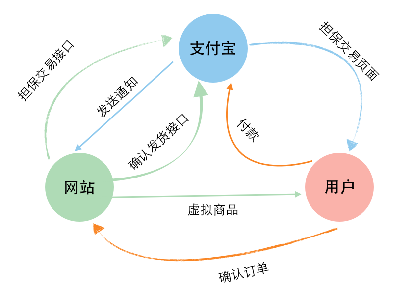

视频：04_new_order.mov

### 内容简介

演示了整个付款过程的宏观逻辑。实现新建订单功能，规划数据库中应有的字段。

### 整体逻辑

创建新的订单。首先要创建 orders 这张表，那么里面具体的字段如何命名呢？那就要去阅读下载得到的开发包中的官方文档了。

根据《纯担保交易接口.pdf》中的第三部分《数据交互》以及下面我自己画的这个流程图，我们可以大致了解一下整个的支付逻辑。

### orders 表中都应该有哪些字段

orders 表中的字段应该是根请求参数或者支付宝返回的通知参数对应的。来看 pdf 的 《4.请求参数说明》，可以看到有些请求参数是可空的，有些是必须的。那么其实 orders 这张表里要存储哪些东西其实每个网站会略有不同的，我这里选择最小的一个集合。

第一个，`out_trade_no` 由我们自己网站生成的订单号，保证唯一性。第二个 `subject` 商品名称，第三个，`total_fee` 总额，其实这个在文档上是“可空”的，一般存储，`price` 和 `quantity` 数量也是可以的，但是我这里就存储一个总额了。第四个，就是 `trade_status` 交易状态了。在 《页面跳转同步通知参数说明》的样例 url 中，可以找到这个名字。最后一个，`cup_id` 记录用户到底买了哪个商品。


rails g model order out_trade_no:string subject:string total_fee:float cup_id:integer

